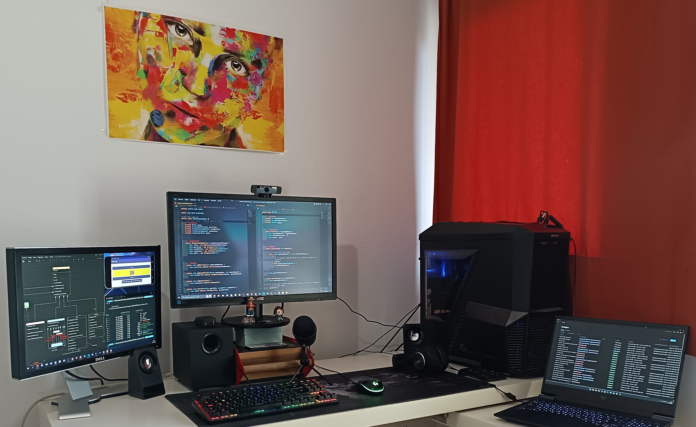

<h1 align="center">Bienvenido a mi espacio de trabajo</h1>

Estudiando actualmente en [**CIFP Francesc de Borja Moll**](https://github.com/cifpfbmoll).

Hace 2 años acabé el **FPGM Sistemas Microinformáticos y Redes** y este año terminaré el **FPGS Desarrollo de aplicaciones Multiplataforma**.

## Tecnologías

Suelo "*cacharrear*" con las diferentes tecnologías que voy aprendiendo para nunca dejar de aprender.

                
 </a>  

## Gráficos extra

**
Algunos gráficos que van monitorizando mi trabajo
**

## Contacto

**Profesional: marcosldlf@gmail.com**

**Escolar: mlopez@cifpfbmoll.eu**
